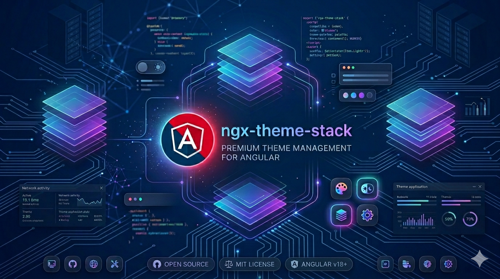

# ngx-theme-stack 🎨



A simple and powerful headless theme manager for **Angular**. Built for performance and SSR support.

## 🚀 Features

- ⚡ **Single Command Installation**: Automatic configuration via `ng add`.
- 🌓 **System Preference Detection**: Automatic synchronization with OS settings (`prefers-color-scheme`).
- 🔄 **Dynamic Switching**: Multiple ways to toggle themes (toggle, cycle, select).
- 🛠️ **Highly Customizable**: Support for custom themes, class prefixes, and configurable storage.
- 🧱 **Modern Architecture**: Powered by Angular Signals for maximum reactivity and performance.
- 🌍 **SSR Ready**: Safe to use in Server-Side Rendering environments.
- 🚫 **Zero Flicker**: Includes an optimized anti-flash script to prevent theme jumps on load.

## 📦 Installation

To install the library and configure it automatically in your project, run:

```bash
ng add ngx-theme-stack
```

### Installation Modes

When running `ng add`, you will be presented with two configuration options:

1.  **Quick Mode**:
    - Applies default configuration instantly.
    - Initial theme: `system`.
    - Apply mode: `class` (adds the theme class to the `<html>` element).
    - Available themes: `['light', 'dark', 'system']`.

2.  **Custom Mode**:
    - Choose which themes to include (e.g., if you have a `blue` or `high-contrast` theme).
    - Configure the default theme upon app startup.
    - Change the `localStorage` key where the theme choice is saved.
    - Decide how to apply themes: via classes (`class`), attributes (`data-theme`), or both.

## 🏗️ Architecture & Extensibility

The library is designed to be flexible. The **`CoreThemeService`** is the foundation:

- **Solid Base:** Manages state (`Signal`), persistence (`localStorage`), system detection (`matchMedia`), and safe DOM manipulation (SSR compatible).
- **Extensibility:** You can inject `CoreThemeService` to build your own custom services or components with specific business logic.

### Utility Services (Ready to Use)

For common use cases, we include three services with predefined logic:

1.  **`ThemeToggleService`**: A simple binary switch between `light` and `dark`.
2.  **`ThemeSelectService`**: Exposes the full list of themes and methods to select them.
3.  **`ThemeCycleService`**: A circular function to cycle through all available themes with a single click.

---

## ⚙️ Supported Versions

| Angular Version | Support   |
| :-------------- | :-------- |
| **Angular 21**  | ✅ Stable |
| **Angular 20**  | ✅ Stable |
| **Angular 19**  | ✅ Stable |
| **Angular 18**  | ✅ Stable |

## 🛠️ Basic Usage

### CoreThemeService API

The foundational service managing the theme state. It exposes pure Angular Signals and a solid minimal API.

```typescript
import { inject } from '@angular/core';
import { CoreThemeService } from 'ngx-theme-stack';

@Component({ ... })
export class MyComponent {
  themeService = inject(CoreThemeService);

  /* --- 📊 Reactive Signals --- */

  // The exact theme chosen by the user ('dark', 'light', 'system', etc.)
  selectedTheme = this.themeService.selectedTheme;

  // The theme finally applied to the DOM (resolves 'system' to 'dark' or 'light')
  resolvedTheme = this.themeService.resolvedTheme;

  // Helper boolean signals evaluating the applied theme
  isDark = this.themeService.isDark;
  isLight = this.themeService.isLight;
  isSystem = this.themeService.isSystem;

  // True after the first browser render. Great for preventing SSR flickering!
  isHydrated = this.themeService.isHydrated;

  /* --- 🛠️ Methods --- */

  changeTheme(newTheme: string) {
    // Validates, applies to the DOM, and saves to localStorage
    this.themeService.setTheme(newTheme);
  }
}
```

### Utility Services Examples

#### ThemeToggleService usage:

```typescript
import { ThemeToggleService } from 'ngx-theme-stack';

@Component({
  selector: 'app-theme-toggle',
  template: `
    <button (click)="toggle.toggle()">Switch to {{ toggle.isDark() ? 'Light' : 'Dark' }}</button>
  `,
})
export class ThemeToggleComponent {
  protected toggle = inject(ThemeToggleService);
}
```

## 🎨 Styling

By default, the library adds the theme name as a class or attribute to the `<html>` element. Use this in your global styles:

```css
/* Using Classes (Default) */
html.dark {
  background-color: #121212;
  color: white;
}

html.light {
  background-color: #ffffff;
  color: #333;
}

/* Using Attributes */
[data-theme='blue'] {
  --primary-color: #0000ff;
}
```

## 📄 License

[MIT](./LICENSE)
